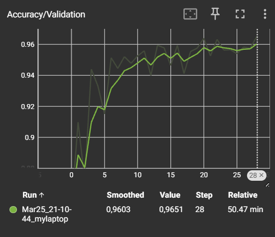
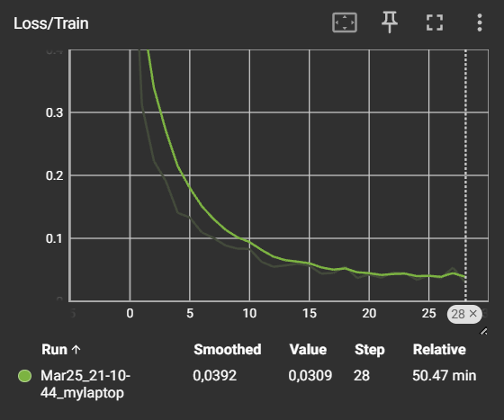
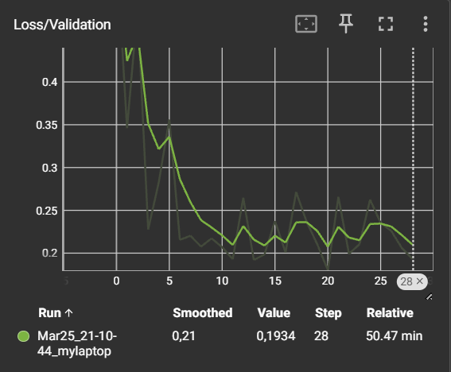
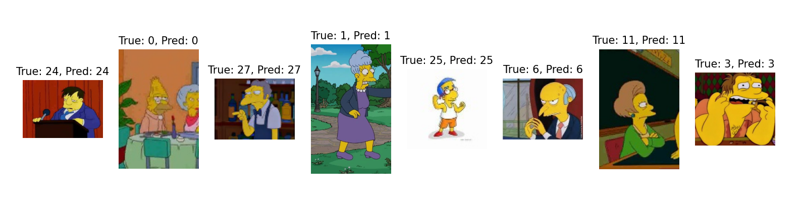
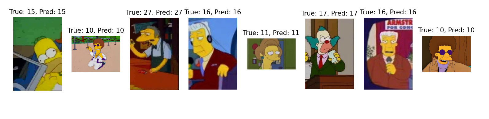
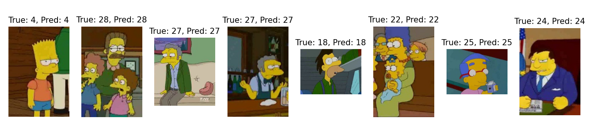

# Классификация персонажей Симпсонов

-------------------------------------------------------------------------------------------------------------------------------------------

## Описание задачи

Целью данного проекта было создание нейросети, способной классифицировать персонажей мультсериала "Симпсоны".

-------------------------------------------------------------------------------------------------------------------------------------------

## Датасет

Исходный датасет (https://www.kaggle.com/datasets/alexattia/the-simpsons-characters-dataset/code) состоял из фотографий размеченных персонажей и был разделен на две части:
- `data/simpsons_dataset/` — тренировочный набор;
- `data/kaggle_simpson_testset/` — тестовый набор.

Для анализа исходных данных я вывела статистику по количеству изображений каждого персонажа в тренировочной и тестовой выборках.

### Распределение данных до изменений:

**Тренировочный датасет** | **Тестовый датасет**  
:-------------------------:|:-------------------------:
 | 

Анализ показал значительный дисбаланс классов: в некоторых категориях насчитывалось 1–2 тысячи изображений, тогда как в других всего по 3. Это могло привести к тому, что модель не сможет эффективно обучиться на редких классах и не будет обладать обобщающей способностью. Ситуация с тестовым датасетом была ещё хуже: многие классы в нём отсутствовали.

Для устранения дисбаланса я вручную добавила изображения в классы с малым количеством примеров. После этой корректировки стало чуть лучше, хотя всё ещё далеким от идеала.

### Распределение данных после изменений:

**Тренировочный датасет** | **Тестовый датасет**  
:-------------------------:|:-------------------------:
 | 

-------------------------------------------------------------------------------------------------------------------------------------------
## Архитектура модели

Для классификации я выбрала предобученную архитектуру **ResNet18**, так как эта модель зарекомендовала себя как эффективная при работе с изображениями и их признаками. Поскольку ResNet изначально обучена на стандартном наборе классов, я использовала её сверточные слои без изменений, но заменила полносвязный выходной слой, адаптировав его под 42 класса моего датасета.

-------------------------------------------------------------------------------------------------------------------------------------------
## Обучение модели

Изначально я запустила обучение модели на 55 эпох, но вскоре заметила, что функция потерь начала колебаться, указывая на переобучение. Для решения этой проблемы я добавила проверку на валидационной выборке после каждой эпохи.

Было принято решение использовать **раннюю остановку**: если в течение 8 эпох подряд средний loss на валидационных данных не улучшается, обучение завершается. Также для мониторинга процесса обучения я использовала **TensorBoard**.

-------------------------------------------------------------------------------------------------------------------------------------------
## Результаты обучения

### Метрики:

| Class | Precision | Recall | F1-Score | Support |
|-------|-----------|--------|----------|--------|
| 0     | 0.98      | 0.94   | 0.96     | 48     |
| 1     | 1.00      | 1.00   | 1.00     | 14     |
| 2     | 1.00      | 0.96   | 0.98     | 50     |
| 3     | 1.00      | 0.65   | 0.79     | 17     |
| 4     | 0.98      | 1.00   | 0.99     | 50     |
| 5     | 0.81      | 1.00   | 0.90     | 13     |
| 6     | 0.89      | 1.00   | 0.94     | 48     |
| 7     | 1.00      | 1.00   | 1.00     | 50     |
| 8     | 1.00      | 1.00   | 1.00     | 11     |
| 9     | 0.94      | 0.98   | 0.96     | 49     |
| 10    | 1.00      | 0.55   | 0.71     | 11     |
| 11    | 0.96      | 0.94   | 0.95     | 50     |
| 12    | 1.00      | 1.00   | 1.00     | 12     |
| 13    | 1.00      | 0.80   | 0.89     | 10     |
| 14    | 1.00      | 1.00   | 1.00     | 13     |
| 15    | 0.93      | 1.00   | 0.96     | 50     |
| 16    | 0.94      | 1.00   | 0.97     | 50     |
| 17    | 0.96      | 1.00   | 0.98     | 50     |
| 18    | 0.98      | 1.00   | 0.99     | 50     |
| 19    | 1.00      | 0.91   | 0.95     | 11     |
| 20    | 1.00      | 0.98   | 0.99     | 50     |
| 21    | 1.00      | 0.91   | 0.95     | 11     |
| 22    | 1.00      | 1.00   | 1.00     | 50     |
| 23    | 0.93      | 1.00   | 0.97     | 14     |
| 24    | 0.96      | 0.98   | 0.97     | 50     |
| 25    | 0.98      | 1.00   | 0.99     | 49     |
| 26    | 1.00      | 0.82   | 0.90     | 11     |
| 27    | 0.94      | 0.98   | 0.96     | 50     |
| 28    | 0.98      | 1.00   | 0.99     | 49     |
| 29    | 0.96      | 1.00   | 0.98     | 50     |
| 30    | 1.00      | 1.00   | 1.00     | 11     |
| 31    | 0.82      | 0.90   | 0.86     | 10     |
| 32    | 0.91      | 1.00   | 0.95     | 50     |
| 33    | 1.00      | 1.00   | 1.00     | 12     |
| 34    | 0.86      | 0.60   | 0.71     | 10     |
| 35    | 1.00      | 1.00   | 1.00     | 11     |
| 36    | 0.86      | 0.60   | 0.71     | 10     |
| 37    | 0.96      | 1.00   | 0.98     | 47     |
| 38    | 1.00      | 0.80   | 0.89     | 10     |
| 39    | 0.89      | 0.80   | 0.84     | 10     |
| 40    | 1.00      | 0.45   | 0.62     | 11     |
| 41    | 1.00      | 1.00   | 1.00     | 10     |
| **Accuracy**       |           |        | **0.96**     | **1243** |
| **Macro Avg**      | **0.96**  | **0.92** | **0.93**   | **1243** |
| **Weighted Avg**   | **0.96**  | **0.96** | **0.96**   | **1243** |

### Примеры выводов модели

